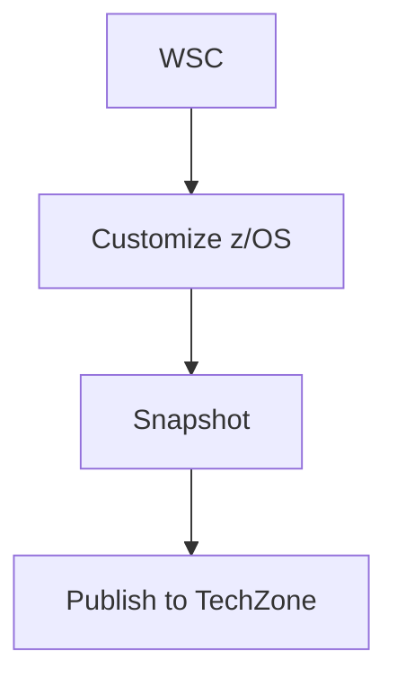

# ZDEP Documentation

Documentation for the **IBM Z Demo Enablement Program (ZDEP)** - a platform for customizing z/OS base images into fully-featured demo images for IBM technical sales, published to TechZone.

## 🌐 Live Sites

- **Public Site**: https://ibm-wsc.github.io/zdep-docs/
- **Internal Site**: https://pages.github.ibm.com/zEco-IaaS/zdep-docs/ (when deployed)

## 🚀 Quick Start for Contributors

### Prerequisites

* Install [Node.JS with NPM](https://nodejs.org/en/download/) - v20 LTS or newer
* Install [Visual Studio Code](https://code.visualstudio.com/Download) (optional but recommended)

### Local Preview

1. **Install dependencies:**
   ```bash
   npm install
   ```

2. **Start preview server:**
   ```bash
   npm run preview
   ```

3. **Open in browser:**
   Navigate to [http://localhost:3000/docs](http://localhost:3000/docs)

The preview server watches your `.md` files and automatically refreshes when you make changes.

## 📝 Writing Documentation

### Adding New Pages

1. Create your `.md` file in the appropriate directory
2. Add it to the `navigation` array in `docs.config.json`
3. Use `internal: true` to restrict pages to IBM Internal audiences only
4. Save and the preview will automatically reload

### Content Guidelines

#### Internal vs. External Content

- **Page-level:** Set `"internal": true` in `docs.config.json` navigation
- **Section-level:** Wrap content in HTML comments:
  ```html
  <!-- internal-only -->
  ## Internal Section
  This content only appears in internal builds.
  <!-- /internal-only -->
  ```

#### Adding Images

Place images in an `assets/` folder next to your `.md` file:
```markdown

```

*Note: Use `../assets/` because during build, your markdown becomes `page-name/index.html`, moving assets one level up.*

#### Linking to Other Pages

```markdown
[Getting Started](../getting-started/onboarding)
[CICS Image](../using-images/catalog/cics/overview)
```

#### Mermaid Diagrams

````markdown

````

## 📂 Documentation Structure

```
zdep-docs/
├── home.md                          # Landing page
├── getting-started/
│   └── onboarding.md               # Internal user onboarding
├── provisioning/
│   ├── provision-workflow.md       # AAP provisioning workflow
│   ├── instance-management.md      # Managing instances
│   └── troubleshooting.md          # Common issues
├── customization/
│   ├── overview.md                 # Customization process
│   ├── zconfig-setup.md           # Setting up zconfig
│   └── middleware/                 # Middleware configs
├── snapshot/
│   ├── overview.md                 # Snapshot process
│   ├── creating-snapshots.md      # How to create
│   └── publishing.md              # Publishing to TechZone
├── using-images/                   # Public-facing content
│   ├── getting-started.md         # For demo users
│   ├── provisioning.md            # Provisioning from TechZone
│   ├── connecting.md              # Connecting to z/OS
│   └── catalog/                   # Image catalog
│       ├── overview.md
│       ├── mlz/                   # Machine Learning images
│       └── cics/                  # CICS images
├── reference/
│   ├── architecture.md            # System architecture
│   └── faqs.md                    # Frequently asked questions
└── internal/                       # IBM Internal only
    ├── platform-architecture.md
    └── deployment-automation.md
```

## 🔧 Configuration

### Site Configuration (`docs.config.json`)

```json
{
  "site": {
    "title": "Z Demo Enablement Program (ZDEP)",
    "prefix": "IBM",
    "description": "Documentation for IBM Z Demo Enablement Program"
  },
  "vars": {
    "basePath": "/zdep-docs",
    "domain": "https://ibm-wsc.github.io"
  },
  "navigation": [
    // Your navigation structure
  ]
}
```

**Important:** The `basePath` must match the repository name for GitHub Pages to work correctly.

### Navigation Structure

- Use `children` to nest items
- Use `internal: true` to restrict pages/sections to internal builds
- Paths are relative to the repository root (without `.md` extension)

## 🚀 Deployment

### First-Time Setup

Before deploying, set up both repositories:

#### 1. Clone the Repositories

```bash
# Clone the internal documentation repo (source)
cd ~/Documents/workdir/git/beamz
git clone git@github.ibm.com:zEco-IaaS/zdep-docs.git

# Clone the public deployment repo (target) - in the parent directory
cd ..
git clone git@github.com:ibm-wsc/zdep-docs.git
```

Your directory structure should look like:
```
~/Documents/workdir/git/
├── beamz/
│   └── zdep-docs/          # Internal repo (source of truth)
└── zdep-docs/              # Public repo (deployment target)
```

#### 2. Install Dependencies

```bash
cd beamz/zdep-docs
npm install
```

#### 3. Make Deploy Script Executable

```bash
chmod +x deploy-public.sh
```

### Daily Workflow: Making Changes and Deploying

#### Step 1: Edit Documentation

```bash
cd ~/Documents/workdir/git/beamz/zdep-docs

# Edit your markdown files
# For example:
code using-images/getting-started.md
```

#### Step 2: Preview Your Changes Locally

```bash
# Start the preview server
npm run preview

# Open http://localhost:3000/docs in your browser
# Verify your changes look correct
# Press Ctrl+C to stop the preview when done
```

#### Step 3: Commit Your Changes to Internal Repo

```bash
# Add your changes
git add .

# Commit with a descriptive message
git commit -m "Update getting started guide with new screenshots"

# Push to internal repo
git push origin main
```

#### Step 4: Deploy to Public Site

```bash
# Run the deployment script
./deploy-public.sh
```

The script will:
1. Build the public documentation (`npm run build:public`)
2. Copy built files to `../../zdep-docs/` (the public repository)
3. Commit and push to trigger GitHub Actions deployment

#### Step 5: Verify Deployment

1. Check GitHub Actions: https://github.com/ibm-wsc/zdep-docs/actions
2. Wait for deployment to complete (~2-3 minutes)
3. Visit: https://ibm-wsc.github.io/zdep-docs/
4. Verify your changes are live

### Manual Deployment (Alternative)

If you prefer to run commands manually instead of using the script:

```bash
# 1. Build public site (strips internal-only content)
npm run build:public

# 2. Copy to public repo
cp -r .docs-engine/out/* ../../zdep-docs/

# 3. Navigate to public repo
cd ../../zdep-docs

# 4. Commit and push
git add .
git commit -m "Deploy: $(date '+%Y-%m-%d %H:%M:%S')"
git push origin main

# 5. Return to internal repo
cd ../beamz/zdep-docs
```

### What Gets Published

**Public Site (github.com/ibm-wsc/zdep-docs):**
- ✅ Demo Delivery section
- ✅ Image Catalog
- ✅ FAQs
- ❌ Image Development section (stripped)
- ❌ IBM Internal sections (stripped)

**Internal Site (github.ibm.com/zEco-IaaS/zdep-docs):**
- ✅ All content including internal-only sections
- ✅ Blue "IBM Internal Only" banners on restricted content

### Build Commands

```bash
# Internal build (includes all content)
npm run build

# Public build (excludes internal content)
npm run build:public

# Preview locally
npm run preview

# Clean build artifacts
npm run clean
```

## 🔄 Deployment Architecture

```
Internal Repo (github.ibm.com/zEco-IaaS/zdep-docs)
    ↓ Manual Build & Deploy (./deploy-public.sh)
Public Repo (github.com/ibm-wsc/zdep-docs)
    ↓ GitHub Actions (Automated)
Live Site (https://ibm-wsc.github.io/zdep-docs/)
```

**Why Manual Deployment?**
GitHub Enterprise (github.ibm.com) doesn't have GitHub-hosted runners available, so we use manual deployment with a simple script.

## 📚 Related Repositories

- **[beamz-docs](https://github.ibm.com/zcomm/beamz-docs/)** - Documentation framework (Next.js + IBM Carbon Design System)
- **[beamz-zlpn-docs](https://github.ibm.com/zcomm/beamz-zlpn-docs)** - Example documentation site for ZLPN program
- **[z1090-deployer-ansible](https://github.ibm.com/zEco-IaaS/z1090-deployer-ansible)** - Ansible playbooks for z/OS provisioning
- **[zconfig-zade](https://github.ibm.com/zEco-IaaS/zconfig-zade)** - Ansible automation for z/OS middleware configuration
- **[mirror-z1090-images](https://github.ibm.com/zEco-IaaS/mirror-z1090-images/tree/cio-aap)** - Playbooks for snapshot and publishing to Cloud Object Storage (cio-aap branch)

## 🆘 Troubleshooting

### Preview won't start

1. Clean the build artifacts: `npm run clean`
2. Remove node_modules: `rm -rf node_modules`
3. Reinstall: `npm install`
4. Try again: `npm run preview`

### Changes not appearing

The preview server has hot-reload, but sometimes you need to:
1. Save your `.md` file
2. Wait a few seconds
3. Refresh your browser

### Deployment issues

**Site shows only README:**
- Verify GitHub Pages source is set to "GitHub Actions" (not "Deploy from a branch")
- Check that `.nojekyll` file exists in public repo

**Missing styles (ugly HTML):**
- The `_next` directory must be included in deployment
- Verify the workflow completed successfully

**Broken links (404 errors):**
- Verify `basePath` in `docs.config.json` is `/zdep-docs`
- Check that domain is `https://ibm-wsc.github.io`

## 📞 Support

For questions or issues:
- **Deployment issues**: Contact Jacob Emery
- **Content updates**: Edit markdown files and run `./deploy-public.sh`
- **Framework issues**: Check beamz-docs repository
- **Slack**: #wsc-demo-hosting-in-techzone-workstreams

## 📄 License

IBM Internal Use Only 