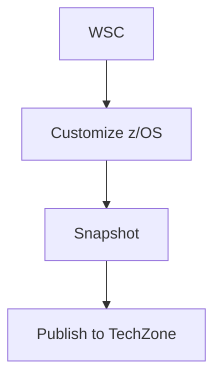

# WSC to TechZone z/OS Demo Asset Pipeline Documentation

This repository contains the documentation for the WSC to TechZone z/OS Demo Asset Pipeline - a platform for customizing z/OS base images into fully-featured demo images for IBM technical sales, published to TechZone.

## 🚀 Quick Start

### Prerequisites

* Install [Node.JS with NPM](https://nodejs.org/en/download/) - v24 LTS or newer
* Install [Visual Studio Code](https://code.visualstudio.com/Download) (optional but recommended)
* Clone both repositories in the same parent directory:
  - `beamz-docs` - The documentation framework
  - `beamz-zos-demo-docs` - This content repository

### Local Preview Setup

The beamz-docs framework needs to be configured to point to this content repository.

1. **Verify directory structure:**
   ```
   your-workspace/
   ├── beamz/
   │   ├── beamz-docs/           # The documentation framework
   │   └── beamz-zos-demo-docs/  # This content repository
   ```

2. **Configure beamz-docs to use this content:**
   
   Edit `beamz-docs/package.json` and add a dependency pointing to this repo:
   
   ```json
   {
     "name": "@c360/beamz-docs",
     "version": "1.1.13",
     "dependencies": {
       "beamz-zos-demo-docs": "file:/Users/jemery/Documents/workdir/git/beamz/beamz-zos-demo-docs"
     }
   }
   ```
   
   **IMPORTANT:** This local file reference should **NOT be committed** to beamz-docs. It's for local development only.

3. **Run the preview from beamz-docs:**
   ```bash
   cd beamz-docs
   npm install
   npm run preview
   ```

4. **Open in browser:**
   Navigate to [http://localhost:3000/docs](http://localhost:3000/docs)

The framework will watch your `.md` files in beamz-zos-demo-docs and automatically refresh the page when you make changes.

## 📝 Writing Documentation

### Adding New Pages

1. Create your `.md` file in the appropriate directory in **this repository** (beamz-zos-demo-docs)
2. Add it to the `navigation` array in `docs.config.json`
3. Use `internal: true` to restrict pages to IBM Internal audiences only
4. Save and the preview will automatically reload

### Content Guidelines

#### Internal vs. External Content

- **Page-level:** Set `"internal": true` in `docs.config.json` navigation
- **Section-level:** Wrap content in HTML comments:
  ```html
  <!-- internal-only -->
  ## Internal Section
  This content only appears in internal builds.
  <!-- /internal-only -->
  ```

#### Adding Images

Place images in an `assets/` folder next to your `.md` file:
```markdown

```

*Note: Use `../assets/` because during build, your markdown becomes `page-name/index.html`, moving assets one level up.*

#### Linking to Other Pages

```markdown
[Onboarding Guide](../getting-started/onboarding)
[CICS Image](../images/cics)
```

#### Mermaid Diagrams

````markdown

````

## 📂 Documentation Structure

```
beamz-zos-demo-docs/
├── home.md                          # Landing page
├── getting-started/
│   └── onboarding.md               # User onboarding guide
├── provisioning/
│   ├── provision-workflow.md       # AAP provisioning workflow
│   ├── instance-management.md      # Managing instances
│   └── troubleshooting.md          # Common issues
├── customization/
│   ├── overview.md                 # Customization process
│   ├── zconfig-setup.md           # Setting up zconfig
│   └── middleware/                 # Middleware configs
├── snapshot/
│   ├── overview.md                 # Snapshot process
│   ├── creating-snapshots.md      # How to create
│   └── publishing.md              # Publishing to TechZone
├── images/
│   ├── cics.md                    # CICS demo image
│   ├── db2.md                     # Db2 demo image
│   └── ims.md                     # IMS demo image
├── using-images/
│   ├── provisioning.md            # Provisioning from TechZone
│   └── demo-scenarios.md          # Demo use cases
├── reference/
│   ├── architecture.md            # System architecture
│   ├── environment-variables.md   # Variable reference
│   └── playbook-reference.md      # Ansible playbooks
└── internal/                       # IBM Internal only
    ├── platform-architecture.md
    ├── deployment-automation.md
    └── maintenance.md
```

## 🔧 Configuration

### Site Configuration (`docs.config.json`)

```json
{
  "site": {
    "title": "WSC z/OS Demo Pipeline",
    "prefix": "IBM",
    "description": "Documentation for WSC to TechZone z/OS Demo Asset Pipeline"
  },
  "vars": {
    "basePath": "/docs"
  },
  "navigation": [
    // Your navigation structure
  ]
}
```

### Navigation Structure

- Use `children` to nest items
- Use `internal: true` to restrict pages/sections to internal builds
- Paths are relative to the repository root (without `.md` extension)

## 🚀 Build & Deployment

### Local Builds

From the `beamz-docs` directory:

```bash
# Internal build (includes all content)
npm run build

# Public build (excludes internal content)
npm run build:public

# Clean build artifacts
npm run clean
```

### GitHub Actions Deployment

The repository will use GitHub Actions to automatically deploy:

- **Internal site:** Hosted on github.ibm.com GitHub Pages (for IBM employees)
- **External site:** Hosted on public GitHub Pages (for customers/partners)

Deployment is triggered by pushing to specific branches:
- `main` branch → Internal build
- `public` branch → Public build

## 📚 Related Repositories

- **beamz-docs** - Documentation framework (Next.js + IBM Carbon Design System)
- **beamz-zlpn-docs** - Example documentation site for ZLPN program
- **zADE-deployer-ansible** - Ansible playbooks for z/OS provisioning
- **zconfig-zade** - Ansible automation for z/OS middleware configuration
- **mirror-zade-images** - Playbooks for snapshot and publishing to Cloud Object Storage

## 🆘 Troubleshooting

### Preview won't start

1. Make sure beamz-docs/package.json has the dependency pointing to this repo
2. Clean the build artifacts: `cd beamz-docs && npm run clean`
3. Remove node_modules: `rm -rf node_modules`
4. Reinstall: `npm install`
5. Try again: `npm run preview`

### Changes not appearing

The preview server has hot-reload, but sometimes you need to:
1. Save your `.md` file in beamz-zos-demo-docs
2. Wait a few seconds
3. Refresh your browser

### Wrong content showing

Make sure beamz-docs/package.json is pointing to the correct absolute path for this repository.

## 📞 Support

For questions or issues:
- Contact: Jacob Emery (jemery@ibm.com)
- Slack: #wsc-z-automation (or your team channel)

## 📄 License

IBM Internal Use Only