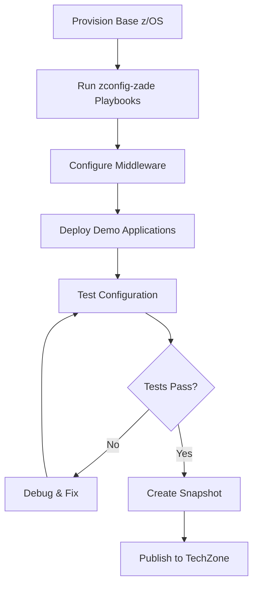

# Image Customization Overview

This section covers how to customize z/OS images to create fully configured, demo-ready environments for TechZone. The customization process transforms a base z/OS image into a specialized demo image with pre-configured middleware, sample applications, and demo scenarios.

## What is Image Customization?

Image customization is the process of:

1. **Provisioning** a base z/OS instance
2. **Configuring** middleware (CICS, Db2, IMS, MQ, etc.)
3. **Installing** demo applications and sample data
4. **Testing** the configuration
5. **Capturing** a snapshot for publishing

The result is a **demo-ready image** that technical sales teams can provision from TechZone with zero additional setup.

---

## Customization Workflow



---

## The zconfig-zade Repository

The [`zconfig-zade`](https://github.ibm.com/zcomm/zconfig-zade) repository contains Ansible playbooks for configuring z/OS middleware using the **zconfig** tool. This automation handles:

- System setup (volumes, SMS, VTAM, log streams)
- Security configuration (RACF profiles, SSL/TLS)
- Middleware deployment (CICS, Db2, IMS, MQ)
- Application compilation and deployment
- Resource testing and verification

### Repository Structure

```
zconfig-zade/
├── site.yaml                  # Master playbook
├── playbooks/
│   ├── cics.yaml              # CICS configuration
│   ├── db2.yaml               # Db2 configuration (future)
│   └── ...
├── roles/
│   ├── zos_setup/             # Shared z/OS setup tasks
│   ├── cics_config/           # CICS configuration role
│   └── ...
├── files/
│   ├── devmap                 # Device mapping
│   └── manifest.yaml          # Deployment manifest
└── requirements.yaml          # Required Ansible collections
```

---

## Customization Modes

### Mode 1: Automated Middleware Configuration

**Use Case**: Configure standard middleware (CICS, Db2, IMS, MQ) with pre-built configurations.

**Process**:
1. Provision z/OS with middleware selection in AAP survey
2. AAP automatically runs zconfig-zade playbooks
3. Middleware is configured and started
4. Demo applications are deployed

**Best For**: Standard demo images with common middleware configurations.

### Mode 2: Manual Customization

**Use Case**: Create specialized configurations or add custom demo content.

**Process**:
1. Provision base z/OS instance
2. SSH to the instance
3. Manually configure middleware and applications
4. Test the changes
5. Create snapshot

**Best For**: Unique demo scenarios or experimental configurations.

### Mode 3: Hybrid Approach

**Use Case**: Start with automated configuration, then add custom content.

**Process**:
1. Provision z/OS with middleware (automated)
2. SSH to the instance
3. Add custom demo applications or data
4. Test everything
5. Create snapshot

**Best For**: Most demo images - combines automation with customization.

---

## What Gets Customized?

### System Configuration

- **Volumes**: Additional storage volumes for middleware and data
- **SMS**: Storage management policies
- **VTAM**: Network configuration for CICS and other subsystems
- **Log Streams**: System logger configuration
- **RACF**: Security profiles and permissions

### Middleware Configuration

Each middleware component includes:

- **Installation**: Software deployment and configuration
- **Security**: RACF profiles, SSL/TLS certificates, keyrings
- **Regions/Instances**: Creation and startup of middleware regions
- **Resources**: Files, programs, transactions, queues, etc.
- **Demo Content**: Sample applications and data

### Demo Applications

- **COBOL Programs**: Classic mainframe applications
- **PL/I Programs**: Business logic examples
- **C/C++ Programs**: Modern language integration
- **Assembler Programs**: Low-level system programming
- **Java Bundles**: OSGi, WAR, EAR applications
- **VSAM Files**: Sample data files

---

## Middleware-Specific Customization

### CICS (Fully Implemented)

The CICS customization is our most mature example and includes:

- **Multiple Regions**: CICSRGN1, CICSRGN2, etc.
- **CMCI**: CICSPlex SM for management
- **Programs**: COBOL, PL/I, C, C++, Assembler examples
- **Transactions**: Pre-defined transaction codes
- **Files**: VSAM file definitions
- **Bundles**: Java application bundles
- **Security**: Complete RACF setup with SSL/TLS

See [CICS Demo Image](../images/cics) for detailed configuration.

### Db2 (Planned)

- Database creation and configuration
- Sample tables and data
- Stored procedures
- Security setup

### IMS (Planned)

- IMS regions and databases
- Transaction definitions
- Sample applications
- IMS Connect configuration

### MQ (Planned)

- Queue managers
- Queue definitions
- Channel configuration
- Security setup

---

## Key Concepts

### zconfig

**zconfig** is a Python tool that generates z/OS configuration files (JCL, PARMLIB, etc.) from YAML templates. Benefits:

- **Declarative**: Describe what is needed, not how to do it
- **Repeatable**: Same configuration every time
- **Version Controlled**: Track changes in Git
- **Testable**: Validate configurations before deployment

### Ansible Automation

Ansible orchestrates the entire customization process:

- **Idempotent**: Safe to run multiple times
- **Modular**: Reusable roles and tasks
- **Documented**: Self-documenting playbooks
- **Integrated**: Works with AAP workflows

### Two-Phase Deployment

Many middleware configurations use a two-phase approach:

**Phase 1 - z/OS Configuration** (runs on z/OS):
- System setup
- Security configuration
- Region deployment
- Program compilation

**Phase 2 - CMCI Deployment** (runs on management host):
- Resource deployment via APIs
- Bundle installation
- Testing and verification

This separation allows for better error handling and clearer progress tracking.

---

## Customization Best Practices

### 1. Start with Automation

Always begin with automated middleware configuration when available. It provides:
- Proven configurations
- Consistent results
- Faster deployment
- Better documentation

### 2. Test Incrementally

Test each customization step:
- After middleware configuration
- After adding demo applications
- After security changes
- Before creating snapshots

### 3. Document Your Changes

Keep track of:
- What was customized
- Why changes were made
- How to reproduce the configuration
- Known issues or limitations

### 4. Use Version Control

Store customizations in Git:
- Configuration files
- Custom scripts
- Demo application code
- Documentation

### 5. Follow Naming Conventions

Use consistent naming for:
- Instance names: `{user}-{middleware}-{purpose}-{number}`
- Volumes: `{instance}.{type}.{number}`
- Regions: `{middleware}RGN{number}`
- Resources: Descriptive, meaningful names

---

## Getting Started

Ready to customize the first image? Follow these guides in order:

1. **[Customization Workflow](./workflow)** - Step-by-step process
2. **[Using zconfig-zade](./zconfig-zade)** - Working with the automation
3. **[Middleware Configuration](./middleware-config)** - Configuring specific middleware
4. **[Testing Your Changes](./testing)** - Verification and validation

---

## Example: Creating a CICS Demo Image

Here's a quick overview of creating a CICS demo image:

### 1. Provision Base Instance

```bash
# In AAP, provision with:
Instance Name: jemery-cics-demo-001
z/OS Image: zos-v3r1-lte1-latest
Middleware: ["cics62"]
```

### 2. Automatic Configuration

AAP automatically runs the CICS playbooks:
- System setup
- CICS regions created
- Programs compiled
- Resources deployed

### 3. Add Custom Content (Optional)

```bash
# SSH to z/OS
ssh zosadmn@192.168.32.16

# Add custom COBOL program
# Upload demo data
# Configure additional transactions
```

### 4. Test Everything

```bash
# Test CICS regions
# Test transactions
# Test programs
# Test files
```

### 5. Create Snapshot

Use the snapshot workflow to capture the customized image.

### 6. Publish to TechZone

Make the demo image available for technical sales teams.

---

## Troubleshooting

### Common Issues

**Middleware won't start**
- Check RACF permissions
- Verify volume configuration
- Review system log for errors

**Programs won't compile**
- Check compiler availability
- Verify dataset permissions
- Review JCL output

**Resources not deploying**
- Check CMCI connectivity
- Verify region is running
- Review API response errors

**Tests failing**
- Check resource definitions
- Verify security setup
- Review transaction logs

### Getting Help

- **zconfig-zade Issues**: Check the repository README and documentation
- **Middleware Questions**: Consult IBM product documentation
- **Platform Support**: Contact Jacob Emery on Slack

---

## Next Steps

- **[Customization Workflow](./workflow)** - Detailed step-by-step guide
- **[Using zconfig-zade](./zconfig-zade)** - Repository and playbook details
- **[Middleware Configuration](./middleware-config)** - Specific middleware guides
- **[Testing Your Changes](./testing)** - Validation procedures