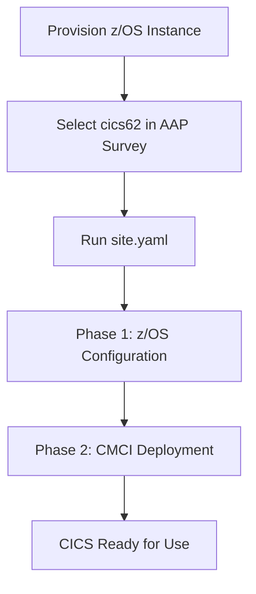

# CICS Deployment Process

This page explains how the CICS demo image is configured and deployed using the `zconfig-zade` repository.

## Overview

The CICS demo image is customized using Ansible playbooks that run during the provisioning workflow. The deployment follows a two-phase approach:

1. **Phase 1** - z/OS host operations (system setup, security, region deployment, compilation)
2. **Phase 2** - CMCI operations from icic_mgmt host (program/bundle/file deployment)

## Automation Flow



### Step-by-Step Flow

1. **Provisioning** - z/OS instance created via [`zADE-deployer-ansible`](https://github.ibm.com/zeco-iaas/zade-deployer-ansible)
2. **Middleware Selection** - User selects `cics62` in AAP survey variable `zos_mware_choice`
3. **CICS Configuration** - `site.yaml` runs `playbooks/cics.yaml`
4. **Two-Phase Deployment** - Automated configuration and deployment

## Phase 1: z/OS Configuration

Runs on the z/OS host via [`playbooks/cics.yaml`](https://github.ibm.com/zeco-iaas/zconfig-zade/blob/main/playbooks/cics.yaml)

### 1. Host Setup

**Role**: `zos_setup`

- Builds runtime Ansible inventory from AAP/OpenStack
- Discovers z/OS IP address from OpenStack metadata
- Tests z/OS connectivity (SSH, ZOAU, Python)

### 2. System Setup

**Task File**: `system_setup.yml`

- Creates and formats USMS01 volume
- Adds volume to SMS storage group (STANDARD)
- Configures VTAM APPL definitions in SYS1.VTAMLST(APPLCICS)
- Sets up CICS log streams (DFHLOG, DFHFWDRECOV)
- Installs CICS SVC (216) in SYS1.PARMLIB(IEASVC00)

### 3. Security Configuration

**Task File**: `security_config.yml`

- Creates Liberty Angel user (BBGZANGL, UID 9999)
- Creates Liberty Angel procedure (BBGZANGL)
- Defines RACF profiles for Angel:
  - `BBG.ANGEL.CICSANGL`
  - `BBG.AUTHMOD.BBGZSAFM.*`
  - `BBG.SECPFX.*`
- Creates CICS keyring (CICSRING)
- Generates self-signed certificates
- Connects certificates to keyring

### 4. Zconfig Installation

**Task File**: `zconfig_install.yml`

- Uploads zconfig wheel file (`zconfig-0.4.0-py3-none-any.whl`) to z/OS
- Installs zconfig via pip3: `pip3 install --user zconfig-0.4.0-py3-none-any.whl`
- Copies pre-tailored zconfig files to `/u/zosadmn/zconfigs/`
- Verifies zconfig installation: `~/.local/bin/zconfig --version`

### 5. Region Deployment

**Task File**: `region_deploy.yml`

- Applies zconfig files: `zconfig apply cics62.yaml`
- Creates CICS regions automatically via zconfig
- Starts regions: `zconfig start CICS62`
- Extracts CMCI ports from zconfig files for Phase 2

**Zconfig Commands**:
```bash
# Apply configuration
~/.local/bin/zconfig apply /u/zosadmn/zconfigs/cics62.yaml

# Start region
~/.local/bin/zconfig start CICS62

# Check status
~/.local/bin/zconfig ls
```

### 6. Program Compilation

**Task File**: `program_compile.yml`

- Creates source library: `CICS62.CICS.SOURCE`
- Creates load library: `CICS62.CICS.LOADLIB`
- Uploads program source files from `roles/cics_config/files/programs/`
- Compiles COBOL programs (HELLO.cbl)
- Supports multiple languages: COBOL, PL/I, C, C++, Assembler, REXX

**Compilation Process**:
```
Source File → Upload to z/OS → Compile → Load Module → LOADLIB
```

## Phase 2: CMCI Deployment

Runs on icic_mgmt host via [`playbooks/cics_cmci.yaml`](https://github.ibm.com/zeco-iaas/zconfig-zade/blob/main/playbooks/cics_cmci.yaml)

### 1. z/OS IP Discovery

**Automatic discovery with 6-level fallback chain**:

1. OpenStack port2 lookup (tap mode)
2. Inventory hostvars lookup
3. OpenStack server_info query
4. Hardcoded fallback (tunnel mode)
5. Manual override via variable
6. Fail with clear error message

### 2. Program Deployment

**Task File**: `program_deploy.yml`

- Discovers compiled programs from `cics_resources.yml`
- Deploys via CMCI API to each region
- Defines programs in CSD group ZCONFIG
- Installs programs in CICS regions

**CMCI API Call**:
```bash
curl -X POST \
  -u CICSUSER:password \
  -H "Content-Type: application/json" \
  http://<zos-ip>:<cmci-port>/CICSSystemManagement/CICSDefinitionProgram/CICS62 \
  -d '{"request": {"create": {"attributes": {"name": "HELLO", "group": "ZCONFIG"}}}}'
```

### 3. Transaction Deployment

- Reads transaction definitions from `cics_resources.yml`
- Creates transactions via CMCI API
- Links transactions to programs
- Installs in CSD group ZCONFIG

**Example Transaction**:
```yaml
transactions:
  - name: HELO
    program: HELLO
```

### 4. File Deployment

**Task File**: `file_deploy.yml`

- Creates VSAM files via CMCI
- Defines files in CICS (CSD group ZCONFIG)
- Sets file permissions (add, browse, delete, read, update)

**Example File**:
```yaml
files:
  - name: EXAMPLE
    dsname: CICS.EXAMPLE.DATA
    add: true
    browse: true
    delete: true
    read: true
    update: true
```

### 5. Bundle Deployment

**Task File**: `bundle_deploy.yml`

- Uploads bundle ZIP files to USS
- Extracts bundles to `/var/cicsts/cics_bundles/`
- Defines bundles via CMCI API
- Installs bundles in CICS regions

**Bundle Deployment Flow**:
```
ZIP File → Upload to USS → Extract → Define via CMCI → Install in Region
```

### 6. Resource Testing

**Task File**: `test_resources.yml`

- Queries CSD definitions (not running resources)
- Verifies programs, transactions, files, bundles
- Reports pass/fail for each resource
- AAP-optimized debug output

**Test Output Example**:
```
✓ Program HELLO defined in CSD
✓ Transaction HELO defined in CSD
✓ File EXAMPLE defined in CSD
✓ Bundle TERMINAL defined in CSD
```

## Resource Definition File

All deployed resources are defined in [`cics_resources.yml`](https://github.ibm.com/zeco-iaas/zconfig-zade/blob/main/roles/cics_config/files/cics_resources.yml):

```yaml
cics_resources:
  programs:
    - name: HELLO
      language: cobol
      source_file: programs/HELLO.cbl
  
  transactions:
    - name: HELO
      program: HELLO
  
  files:
    - name: EXAMPLE
      dsname: CICS.EXAMPLE.DATA
      add: true
      browse: true
      delete: true
      read: true
      update: true
  
  bundles:
    - name: TERMINAL
      source_file: bundles/terminal.zip
    - name: VSAM
      source_file: bundles/vsam.zip
```

## Deployment Timeline

Typical deployment times:

- **Phase 1 (z/OS)**: 15-20 minutes
  - System setup: 5 minutes
  - Security config: 3 minutes
  - Zconfig install: 2 minutes
  - Region deployment: 5 minutes
  - Program compilation: 3 minutes

- **Phase 2 (CMCI)**: 5-10 minutes
  - IP discovery: 1 minute
  - Program deployment: 2 minutes
  - File/bundle deployment: 3 minutes
  - Resource testing: 2 minutes

**Total**: Approximately 20-30 minutes for complete CICS deployment

## Verification

After deployment completes, verify CICS is running:

### Check Region Status

```bash
ssh zosadmn@<zos-ip>
~/.local/bin/zconfig ls
```

Expected output:
```
CICS62    RUNNING    CMCI: 10080
```

### Test CMCI API

```bash
curl -u CICSUSER:password \
  http://<zos-ip>:10080/CICSSystemManagement/CICSRegion/CICS62
```

### Test Transaction

1. Connect via 3270 emulator to `<zos-ip>:2023`
2. Enter transaction: `HELO`
3. Verify "Hello World" message appears

## Troubleshooting Deployment

### Phase 1 Issues

**Zconfig installation fails**:
- Check Python 3.13 is installed: `/usr/lpp/IBM/cyp/v3r13/pyz/bin/python3 --version`
- Check pip3 is available: `pip3 --version`
- Verify zconfig wheel file uploaded correctly

**Region won't start**:
- Check CICS SVC installed: `D PROG,LNKLST`
- Check Liberty Angel started: `D A,BBGZANGL`
- Check log streams defined: `D LOGGER,LOGSTREAM,LSN=CICSPRD.CICS62.*`

### Phase 2 Issues

**CMCI connection fails**:
- Verify z/OS IP discovery succeeded
- Check CMCI port from zconfig: `grep cmci_port /u/zosadmn/zconfigs/cics62.yaml`
- Test CMCI manually: `curl http://<zos-ip>:<cmci-port>/CICSSystemManagement`

**Program deployment fails**:
- Verify program compiled: `tsocmd "LISTDS 'CICS62.CICS.LOADLIB' MEMBERS"`
- Check CMCI credentials
- Verify CSD group ZCONFIG exists

## Next Steps

- **[Configuration Details](./configuration)** - Detailed configuration settings
- **[Customization Guide](./customization)** - Add custom programs and bundles
- **[Troubleshooting](./troubleshooting)** - Common issues and solutions