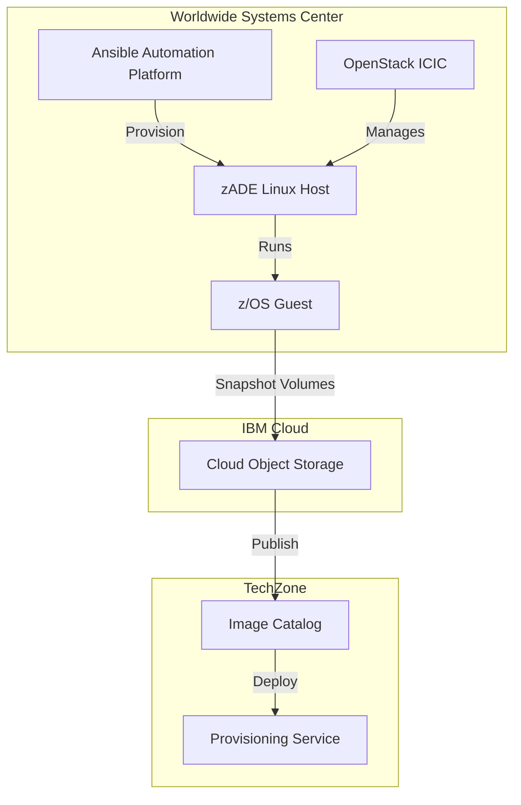

# Architecture Overview

High-level architecture of the WSC to TechZone z/OS Demo Asset Pipeline.

## System Components

### 1. Worldwide Systems Center (WSC)

The WSC hosts the infrastructure for creating and customizing z/OS demo images:

- **zADE Servers**: Linux hosts running zPDT (z/OS Personal Development Tool)
- **OpenStack Infrastructure**: IBM Cloud Infrastructure Center (ICIC)
- **Ansible Automation Platform**: CIO AAP for orchestration
- **Storage**: Cinder block storage for z/OS volumes

### 2. IBM Cloud Object Storage (COS)

Central repository for z/OS image artifacts:

- **Base Images**: Standard z/OS images with middleware
- **Customized Images**: Fully configured demo images
- **Metadata**: Manifest files and device maps

### 3. TechZone

IBM's technical enablement platform:

- **Image Catalog**: Published demo images
- **Provisioning**: Self-service deployment
- **Access Control**: IBMid-based authentication

## Architecture Diagram

## Data Flow

### Image Creation Flow

1. **Provision Base Image**
   - AAP triggers zADE provisioning playbooks
   - OpenStack creates Linux VM and attaches storage
   - z/OS base image downloaded from COS
   - z/OS started in zPDT

2. **Customize Image**
   - AAP runs zconfig-zade playbooks
   - Middleware configured (CICS, Db2, IMS, MQ)
   - Applications deployed and tested
   - Configuration validated

3. **Snapshot & Publish**
   - z/OS volumes captured and compressed
   - Tarball created with manifest and devmap
   - Uploaded to COS bucket
   - Symlinks updated for "latest" version

4. **TechZone Integration**
   - COS bucket registered in TechZone catalog
   - Provisioning templates created
   - Access controls configured

### Provisioning Flow (End User)

1. **Request Image**
   - User browses TechZone catalog
   - Selects demo image
   - Submits provisioning request

2. **Deploy Instance**
   - TechZone provisions infrastructure
   - Downloads image from COS
   - Configures networking and access
   - Starts z/OS instance

3. **Access Instance**
   - User connects via VPN
   - SSH to z/OS or 3270 emulator
   - Runs demo scenarios

### Playbook Repositories

- **zADE-deployer-ansible**: Provisioning automation
- **zconfig-zade**: Middleware configuration
- **mirror-zade-images**: Snapshot and publishing
